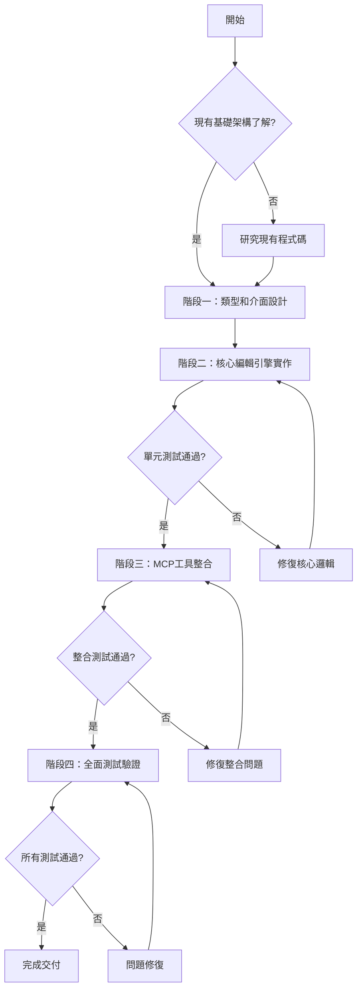

# 增強型多模式 Scratchpad 編輯工具實作

## 1. 背景與目標

### 背景分析
- **現況問題**：當前 scratchpad 系統只支援 append（追加）和 chop（刪除末尾）操作，缺乏精確編輯能力，無法滿足 workflow 文件編輯的複雜需求
- **影響範圍**：所有使用 scratchpad 儲存 workflow 文件的用戶和 AI 代理
- **歷史脈絡**：資料庫層面已有 `updateScratchpadContent` 方法，但缺乏對應的 MCP 工具層，形成功能缺口

### 目標設定
- **主要目標**：實作統一的 `update-scratchpad` MCP 工具，支援四種精確編輯模式
- **次要目標**：提升網路傳輸效率，改善版本控制友善性，為未來高級編輯功能打基礎
- **非目標**：不修改現有 append/chop 工具，不影響現有搜尋和 FTS5 功能

### 約束條件
- **技術約束**：必須維持與現有系統的一致性，重用現有基礎設施
- **業務約束**：不能影響現有功能穩定性，需要完整向下相容
- **時間約束**：預估 1-2 週完成開發和測試

## 2. 需求分析

### 功能需求
- **核心功能**：四種編輯模式（完全替換、行號插入、範圍替換、標記追加）
- **增強功能**：智慧標記搜尋、行處理優化、詳細操作反饋

### 非功能需求
- **性能要求**：編輯操作回應時間 < 100ms，支援最大 1MB 文件
- **安全要求**：活躍 workflow 檢查、參數驗證、事務保護
- **可用性要求**：直觀的模式選擇、清晰的錯誤訊息、完整的操作日誌

## 3. 技術方案設計

### 方案評估
| 方案 | 優點 | 缺點 | 風險 | 建議 |
|------|------|------|------|------|
| 單一工具多模式 | 統一介面、參數驗證集中、維護簡單 | 單一工具複雜度高 | 參數驗證複雜 | ✓ |
| 多個工具分別實作 | 每個模式邏輯清晰 | 介面不統一、重複代碼多 | 維護成本高 | ✗ |

### 最終決策
- **選擇方案**：單一工具多模式設計
- **決策理由**：
  1. 技術適配性：符合現有 MCP 工具設計模式
  2. 維護成本：統一介面降低學習和維護成本
  3. 擴展性：為未來新增編輯模式提供良好架構

### 架構設計
```
MCP Layer: update-scratchpad
    ↓
Parameter Validation Layer: validateEnhancedUpdateArgs
    ↓
Edit Mode Router: 選擇編輯模式
    ↓
Core Editor Engine: LineEditor 類別
    ↓
Database Layer: updateScratchpadContent (既有)
```

## 4. 執行計畫流程圖



## 5. 詳細實作步驟

### 階段一：類型定義與介面設計（預估 2 小時）✅ **已完成**
- [✅] **類型定義**
  - 在 `src/database/types.ts` 新增 EnhancedUpdateScratchpadArgs 介面
  - 定義 EnhancedUpdateScratchpadResult 回傳格式
  - 建立編輯模式列舉類型
- [✅] **參數驗證邏輯**
  - 在 `src/server-helpers.ts` 實作 validateEnhancedUpdateScratchpadArgs
  - 設計模式相依參數的條件驗證
  - 建立詳細的錯誤訊息系統

### 階段二：核心編輯引擎實作（預估 6 小時）✅ **已完成**
- [✅] **LineEditor 核心類別**
  - 基於 chopScratchpadTool 的行處理邏輯，建立統一的行編輯引擎
  - 實作四種編輯模式的核心算法
  - 建立智慧標記搜尋功能（append_section 模式使用）
- [✅] **單元測試撰寫**
  - 每種編輯模式的正常情況測試
  - 邊界條件測試（空文件、單行文件、越界操作）
  - 錯誤處理測試（無效參數、權限檢查）

### 階段三：MCP 工具整合（預估 2 小時）✅ **已完成**
- [✅] **工具實作**
  - 在 `src/tools/scratchpad.ts` 實作 enhancedUpdateScratchpadTool
  - 整合現有的權限檢查和事務保護機制
  - 實作詳細的操作反饋和日誌記錄
- [✅] **服務註冊**
  - 在 `src/server.ts` 註冊 'update-scratchpad' 工具
  - 配置路由和錯誤處理

### 階段四：全面測試與驗證（預估 2 小時）✅ **已完成**
- [✅] **整合測試**
  - MCP 協議正確性測試
  - 與現有工具的相容性測試
  - 併發操作安全性測試
- [✅] **回歸測試**
  - 確保現有 append/chop 功能不受影響
  - 驗證 FTS5 搜尋功能正常
  - 檢查事務和錯誤處理機制

## 6. 四種編輯模式技術規格

### Mode 1: `replace` - 完全替換
```typescript
// 參數: { mode: 'replace', content: string }
// 邏輯: 直接調用 updateScratchpadContent
// 用途: 文件重寫、模板替換
```

### Mode 2: `insert_at_line` - 行號插入
```typescript
// 參數: { mode: 'insert_at_line', content: string, line_number: number }
// 邏輯: lines.splice(line_number - 1, 0, ...newLines)
// 用途: 程式碼插入、段落添加
```

### Mode 3: `replace_lines` - 範圍替換
```typescript
// 參數: { mode: 'replace_lines', content: string, start_line: number, end_line: number }
// 邏輯: lines.splice(start_line - 1, end_line - start_line + 1, ...newLines)
// 用途: 精確修改、區塊更新
```

### Mode 4: `append_section` - 標記追加
```typescript
// 參數: { mode: 'append_section', content: string, section_marker: string }
// 邏輯: 搜尋標記 → 計算插入點 → 智慧插入
// 用途: 結構化文件編輯、markdown 章節管理
```

## 7. 測試策略

### 測試層級
1. **單元測試**
   - 覆蓋率目標：90%
   - LineEditor 每個方法的獨立測試
   - 邊界值和錯誤條件測試

2. **整合測試**
   - MCP 工具端到端測試
   - 資料庫事務一致性測試
   - 多模式綜合操作測試

3. **回歸測試**
   - 現有功能不受影響驗證
   - 效能基準測試
   - FTS5 搜尋功能驗證

### 關鍵測試案例
```typescript
// 測試案例設計
describe('Enhanced Update Scratchpad', () => {
  describe('replace mode', () => {
    test('normal replacement')
    test('empty content replacement')
    test('large content replacement')
  })
  
  describe('insert_at_line mode', () => {
    test('insert at beginning')
    test('insert at middle')
    test('insert at end')
    test('out of bounds handling')
  })
  
  describe('replace_lines mode', () => {
    test('replace single line')
    test('replace multiple lines')
    test('replace with different line count')
    test('invalid range handling')
  })
  
  describe('append_section mode', () => {
    test('append to existing section')
    test('section marker not found')
    test('multiple same markers')
  })
})
```

## 8. 風險管理

### 已識別風險
| 風險項目 | 可能性 | 影響度 | 緩解措施 | 應變計畫 |
|----------|--------|--------|----------|----------|
| 參數驗證邏輯錯誤 | 中 | 高 | 完整單元測試覆蓋 | 分階段發布，逐步驗證 |
| 現有功能回歸 | 低 | 高 | 完整回歸測試套件 | 快速回滾機制 |
| 效能下降 | 中 | 中 | 效能基準測試 | 演算法優化 |
| 邊界條件處理不當 | 高 | 中 | 邊界值測試專項 | 保守的預設行為 |

## 9. 依賴與資源

### 技術依賴
- **既有方法**：ScratchpadDatabase.updateScratchpadContent
- **參考邏輯**：chopScratchpadTool、tailScratchpadTool 的行處理
- **基礎設施**：現有 MCP 架構、事務機制、錯誤處理

### 開發資源
- **開發技能**：TypeScript、Node.js、MCP 協議、SQLite
- **測試工具**：Vitest、現有測試框架
- **文件工具**：現有註釋和文件系統

## 10. 成功指標與驗證

### 量化指標
- **功能指標**：四種編輯模式全部實作完成
- **品質指標**：單元測試覆蓋率 > 90%，所有測試通過
- **效能指標**：編輯操作回應時間 < 100ms

### 質化指標
- **用戶體驗**：介面直觀，錯誤訊息清晰
- **維護性**：程式碼結構清晰，符合現有架構模式
- **擴展性**：為未來新增編輯模式提供良好基礎

## 11. 時程規劃

### 里程碑
- **M1**：類型定義完成（Day 1 上午）
- **M2**：核心編輯引擎完成（Day 2-3）
- **M3**：MCP 工具整合完成（Day 4 上午）
- **M4**：全面測試完成（Day 4-5）

### 關鍵路徑
1. 類型定義 → 核心引擎 → MCP 整合 → 測試驗證
2. 單元測試與開發並行進行
3. 整合測試依賴 MCP 整合完成

## 12. 品質保證

### 程式碼品質
- **類型安全**：完整的 TypeScript 類型定義
- **錯誤處理**：詳細的異常捕獲和處理
- **日誌記錄**：操作追蹤和調試支援

### 測試品質
- **覆蓋率**：目標 90% 以上
- **測試類型**：單元、整合、回歸測試全覆蓋
- **自動化**：整合到現有 CI/CD 流程

## 13. 文件更新計畫

### 技術文件
- **API 文件**：新工具的完整參數說明
- **實作文件**：核心演算法和設計決策記錄
- **測試文件**：測試案例和預期結果

### 使用指南
- **模式選擇指南**：何時使用哪種編輯模式
- **最佳實踐**：常見編輯場景和建議做法
- **故障排除**：常見問題和解決方案

---

### 最終檢查清單
- [✅] 四種編輯模式全部實作並測試
- [✅] 與現有系統完全相容
- [✅] 效能符合預期要求
- [✅] 錯誤處理和安全機制完善
- [✅] 文件更新完成
- [✅] 回歸測試全部通過